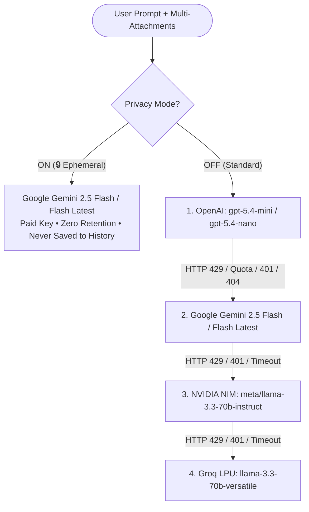

# 🚀 OmniChat Deployment & System Architecture Guide

An all-in-one AI chat platform built for personal high-productivity use, featuring **17 specialized agent plugins**, heavy **multi-attachment processing** (unlimited images, multi-page PDFs, CSVs, code), **smart multi-provider fallback cascading**, and **zero-retention privacy routing**

---

## 🏗️ System Architecture



---

## 🤖 The 17 Renamed Specialized Agent Plugins

Every agent has a specialized personality, system prompt, output formatting, and tool integrations:

| Agent Key | Renamed Title | Creative Focus & Daily Scenario | Built-in Features |
|---|---|---|---|
| `kidstory` | **SlumberScribe** | Bedtime fables for sweet dreams & reading practice | **🔊 Web Speech Read Aloud**, bedtime pacing, bold vocabulary, sweet dreams questions |
| `studybuddy` | **SynapseSpark** | ELI5 concept breakdowns & math intuition | **LaTeX KaTeX formulas** ($...$, $$...$$), Feynman analogies, concept check quiz |
| `worksheet` | **PrintMatrix** | Instant printable worksheets & exam sheets | **🖨️ One-click Print / PDF Export**, Section A–D structure, detachable answer key |
| `dataanalyst` | **FormulaViking** | Looker Studio, Tableau LODs ({FIXED}), SQL & CSVs | Calculated fields (`CASE WHEN`, `REGEXP`), BigQuery/Postgres window functions, CSV analysis |
| `doctor` | **PharmaOracle** | Decodes messy prescriptions & lab bloodwork | Medication timing (BID, PRN), lab values table (Normal/High/Low), **5 questions for your doctor** |
| `psycho` | **MindZenith** | CBT thought reframing & emotional clarity | Identifies cognitive distortions, active listening, Box Breathing & 5-4-3-2-1 grounders |
| `spiritual` | **DharmaCompass** | Gita wisdom, Stoic equanimity & life purpose | Bhagavad Gita (Karma Yoga), Marcus Aurelius (Dichotomy of Control), **🔊 Read Aloud Voice** |
| `legal` | **ContractHawk** | Fine-print predator: hunts red flags & traps | Leases, NDAs, freelance contracts, predatory clauses, one-sided terms, plain English summary |
| `fitness` | **IronValkyrie** | Hypertrophy splits, biomechanics & macro plans | Custom training splits, progressive overload, injury-prevention cues, calorie/macro calculator |
| `coder` | **SyntaxOverlord** | Full-stack systems architect & zero-defect debugger | Next.js App Router, TypeScript, Python, async queuing, architectural trade-offs |
| `email` | **InboxDiplomat** | High-stakes email composer & negotiation maestro | Salary negotiation, diplomatic pushbacks, polite declines, cold outreach, executive updates |
| `finance` | **MoneyAlchemist** | Receipt/bill audit from photos & budget leakage | Photo audits of receipts/bills, hidden fee detection, 50/30/20 budgeting, tax concepts |
| `chef` | **FlavorAlchemist** | Fridge raider: fridge photo ➔ gourmet recipes | Photo of fridge/pantry ➔ 2-3 custom recipes, prep times, substitutions, macros |
| `travel` | **TripVoyager** | Day-by-day vacation architect & hidden gems | Geographic day-by-day pacing, local eateries, weather-optimized packing lists, **🖨️ Print/PDF** |
| `career` | **ResumeVanguard** | ATS resume revamp, impact bullets & interview prep | Google XYZ formula bullets, ATS keyword matching, 5 behavioral interview questions |
| `viral` | **ViralCrafter** | Magnetic hooks, LinkedIn stories & X threads | Scroll-stopping opening hooks, LinkedIn storytelling, viral Twitter/X threads, YouTube scripts |
| `general` | **OmniSpark** | Multi-disciplinary cognitive partner for everything | General writing, research, brainstorming, multi-file synthesis |

---

## ⚡ Smart Multi-Provider Fallback Cascade

ChatGPT and Claude often fail when rate-limited, when API credits run out, or during outages. OmniChat implements an automatic 4-tier cascade:

1. **Primary Provider: OpenAI (ChatGPT)**
   - Models: `gpt-5.4-mini` (Default) or `gpt-5.4-nano`.
   - Automatic model safeguard: If `gpt-5.4-mini` returns 404/not provisioned on your API key tier, it immediately tests `gpt-4o-mini` on OpenAI before falling back.
2. **Tier 1 Backup: Google Gemini**
   - Models: `gemini-2.5-flash` or `gemini-flash-latest`.
   - Massive 1M+ context window with ultra-fast multimodal inference.
3. **Tier 2 Backup: NVIDIA NIM**
   - Model: `meta/llama-3.3-70b-instruct` or `nvidia/llama-3.1-nemotron-70b-instruct`.
   - High-throughput open-weights execution via NVIDIA NIM.
4. **Tier 3 Backup: Groq LPU**
   - Model: `llama-3.3-70b-versatile` or `llama-3.1-8b-instant`.
   - Near-instantaneous generation at 500+ tokens per second.

### Live Telemetry in UI
When a fallback occurs, OmniChat injects telemetry directly into the response header:
```
⚡ Switched to GEMINI (gemini-2.5-flash) because prior attempts failed: openai (gpt-5.4-mini) HTTP 429: Rate limit exceeded
```
You always know exactly which model answered your request.

---

## 🔒 Zero-Retention Privacy / Incognito Mode

### Why It Exists
OpenAI standard consumer endpoints may share or retain data for model training unless under specific enterprise terms. You indicated you possess a paid Google Gemini API key with zero-retention terms where prompts are never used for training.

### How It Operates
- When you flip the **Privacy Mode** switch in the top navigation bar:
  1. **Strict Gemini-Only Lock:** Requests to OpenAI, NVIDIA, or Groq are **completely blocked and bypassed**.
  2. **Zero Ephemeral Storage:** The chat session is marked `isTemporary: true`. It is **never saved to browser localStorage or conversation history**.
  3. **Visual Verification:** A glowing emerald privacy shield confirms zero-retention execution.

---

## 📎 Unlimited Multi-Attachment Pipeline

ChatGPT and Claude frequently fail or reject prompts with multiple large files. OmniChat solves this with a multi-file client-side pipeline:

- **Images (`image/*`):** Converted to base64 Data URLs with multimodal vision tokens.
- **PDF Documents (`.pdf`):** Client-side parser extracts text across multi-page documents (up to 15 pages per document) into structured context blocks.
- **Tabular Data (`.csv`, `.tsv`, `.xlsx`):** Structured and tagged for Looker Studio, Tableau, and spreadsheet formulas.
- **Code & Text (`.py`, `.ts`, `.sql`, `.json`, `.txt`, `.md`):** Formatted with line counts and syntax blocks.
- **Workflow:** Drag & drop multiple files simultaneously, paste images from your clipboard (`Ctrl+V`), and inspect or remove staged attachments before sending.

---

## 🌐 Deployment to Vercel (Recommended)

Next.js App Router deploys natively on Vercel:

### Step 1: Push to GitHub / GitLab
```bash
git init
git add .
git commit -m "feat: initial OmniChat platform"
git branch -M main
git remote add origin https://github.com/your-username/omnichat.git
git push -u origin main
```

### Step 2: Import into Vercel
1. Log in to [vercel.com](https://vercel.com).
2. Click **Add New... ➔ Project**.
3. Select your `omnichat` Git repository.

### Step 3: Configure Environment Variables
In the Vercel project configuration, expand **Environment Variables** and add:

| Variable Name | Description | Example |
|---|---|---|
| `OPENAI_API_KEY` | Primary ChatGPT key (`gpt-5.4-mini`, `gpt-5.4-nano`) | `sk-proj-...` |
| `GEMINI_API_KEY` | Backup 1 & Zero-Retention Privacy key (`gemini-2.5-flash`) | `AIzaSy...` |
| `NVIDIA_API_KEY` | Backup 2 key via NVIDIA NIM (Optional) | `nvapi-...` |
| `GROQ_API_KEY` | Backup 3 key via Groq LPU (Optional) | `gsk_...` |

*(Note: `GOOGLE_AI_API_KEY` is also supported as an alias for `GEMINI_API_KEY`.)*

### Step 4: Deploy
Click **Deploy**. Vercel will run the build:
```bash
next build
```
Once complete, you will receive your live URL: `https://your-project.vercel.app`.

---

## ☁️ Deployment to Cloudflare Pages

OmniChat is fully compatible with Cloudflare Pages via `@cloudflare/next-on-pages` or standard Node.js serverless runtimes:

1. In the [Cloudflare Dashboard](https://dash.cloudflare.com), go to **Workers & Pages ➔ Create application ➔ Pages**.
2. Connect your Git repository.
3. Set the build configuration:
   - **Framework preset:** `Next.js`
   - **Build command:** `npx @cloudflare/next-on-pages` or `bun run build`
   - **Output directory:** `.vercel/output/static` (or `.next`)
4. In **Settings ➔ Environment Variables**, add your `OPENAI_API_KEY`, `GEMINI_API_KEY`, `NVIDIA_API_KEY`, and `GROQ_API_KEY`.
5. Deploy.

---

## ⚙️ In-App Client-Side Settings (No Redeploy Required)

If you prefer not to store API keys in Vercel environment variables, you can configure them directly inside the app:
1. Open OmniChat in any browser.
2. Click the **Gear icon (⚙️)** in the top right corner.
3. Paste your personal keys for OpenAI, Gemini, NVIDIA, and Groq.
4. Click **Test** next to each key to verify real-time connectivity with the provider.
5. Click **Save Settings**.
6. Keys are saved securely in your browser's private `localStorage` and sent directly via secure request headers.

---

## 🧪 Local Development & Verification

```bash
# 1. Install dependencies
bun install
# or: npm install

# 2. Type-check
bun x tsc --noEmit

# 3. Production build test
bun run build

# 4. Start production server
bun run start -p 3000
```

---

## ❓ Frequently Asked Questions & Troubleshooting

### Q: Why did OmniChat answer with Gemini when I had OpenAI selected?
**A:** If OpenAI's API returns HTTP 429 (quota or rate limit reached) or an outage occurs, OmniChat's auto-fallback engine automatically switches to Google Gemini to ensure your chat is never interrupted. Look at the message badge to see the reason for the switch.

### Q: Does Privacy Mode use my OpenAI credits?
**A:** No. When Privacy Mode is active, OpenAI is completely blocked. Zero tokens are sent to OpenAI or third-party loggers; prompts route exclusively to Google Gemini.

### Q: Can I print worksheets or doctor analyses without the chat bubbles?
**A:** Yes! On any message generated by **PrintMatrix** (Worksheet) or **PharmaOracle** (Doctor), click the **Print / PDF** button. A clean printable window will open with headers, line items, and detachable answer keys, formatted cleanly for home and office printers.

### Q: How do I listen to bedtime stories out loud?
**A:** When using **SlumberScribe** (KidStory), click the **Read Aloud** button on the story. The built-in Web Speech synthesizer will narrate the bedtime story at a soothing, gentle tempo.
